# **Repositorio de servicio multimedia de Fénix.**

empaquetado de fuinciones que se comunican con la base de fenix e interactuar con los sp para control de cartas de cambaceo en imagen.

## **Instalación**
### **requisitos previos**

    • tener instalado golang en el equipo 
    • bajar librerias de go
        • Las librerias de go que se necesitan, se pueden bajar desde github.
    • editor (visual studio code, preferente, pero no necesario)
    • conexion a base
    • verificar que los sp existan en la base que se ejecuta

### **elementos necesarios**

    • carpeta con elementos de aplicación (apiRest)
    • imagenes par cargar

### **desplegando aplicativo**

    1.-descarga de gogs
        •   git clone git@10.54.36.90:jiglesias/GoapirestCartaImagen.git
    2.-Abre la carpeta apirest en terminal
 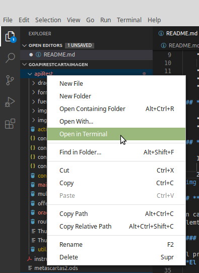
 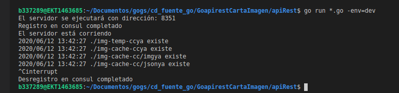
    3.-Abre en navegador con http://localhost:puerto/static/

 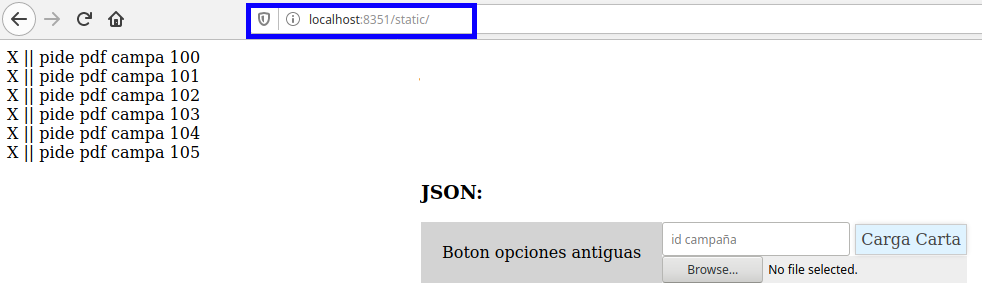

## ***Uso desde postman***

en caso que no se cuente con interfaz para interactuar con las ligas de carga edicion y eliminacion de imagenes, se puede acudir a las ligas directas desde algun ide como `postman` solo se necesitan los elemtos de la liga y la conexion a base (dev,qa...etc)

#### **traer pdf de cartas**

el proceso actual en el fenix ya cuenta con una funcion que regresa el pdf al navegador que se puede descargar como `pdf`. 
**El proceso debe ser transparente para el front**

    • tipo de peticion POST
    • url /insertaImagenBase
    • elementos del body:

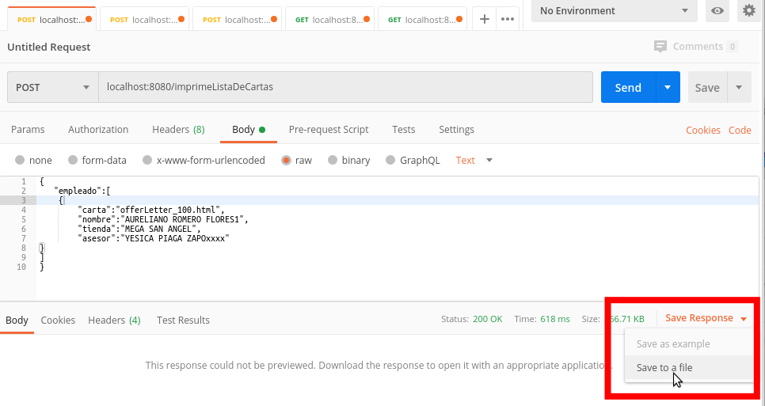
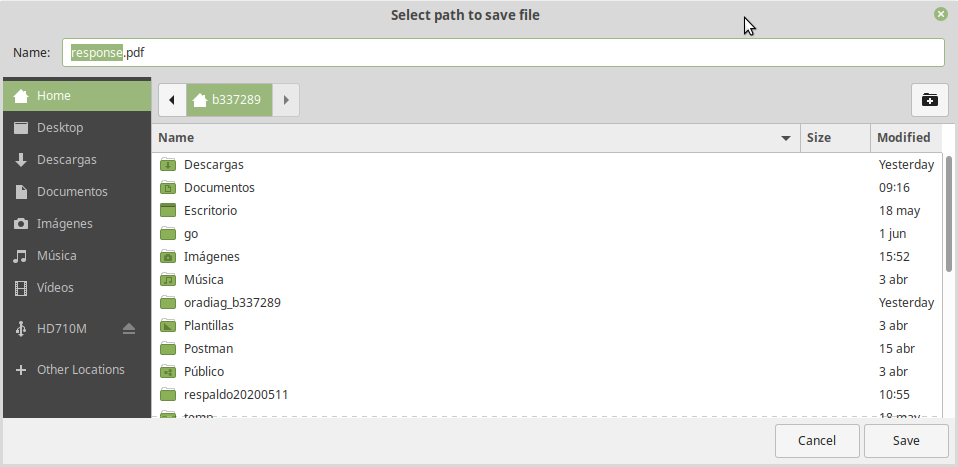

#### **cargar de imagenes**
    • tipo de peticion POST
    • url /insertaImagenBase
    • elementos del body:
        • myfile : image/png
        • campa  : texto numerico
        • etiq   : texto de etiquetas

    resultado: insersion de imagen exitosa

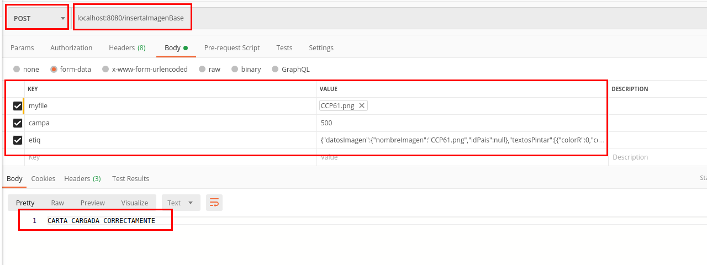

#### **editar de imagenes**

se ocupa el `mismo proceso de carga de imagenes`, con un id de campaña que ya exista
si el id de campaña no existe se inserta, de lo contrario se `actualiza`.

#### **eliminar de imagenes**

    • tipo de peticion POST
    • url /insertaImagenBase
    • elementos del body:
        • campa  : texto numerico
    
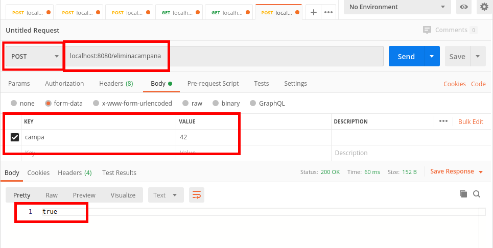

## ***Uso desde aplicacion***

se creo una pagina que se consume desde la ip del servicio go en esta liga
http://10.112.93.208:9999/static/ que es la liga desde la que se consumen los servicios de go

de cualquier forma, si se configuran los datos apuntando a la liga de la base y los objetos existen, el proyecto fue configurado en el equipo y tiene conexion a `produccion o a desarrollo`, desde la liga

http://localhost:8080/static/

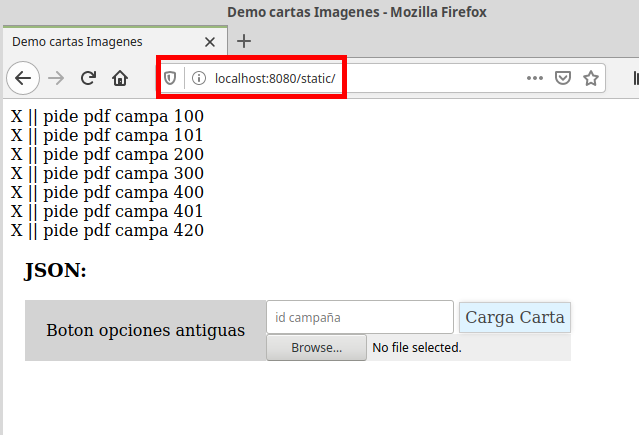

Esta aplicacion consiste en una pagina con librerias javascript que permiten ver las campañas que tengan imagen, eliminarlas, volverlas a cargar, y mover elementos tipo caja para poner etiquetas.

#### **traer pdf de cartas**

click en el boton que dice `pide pdf campa #___` y espera a que el navegador te muestre el pop para descargar el pdf

el codigo hace que si una carta `no existe` y son varias cartas, las que no esten creadas no se generan en el pdf.

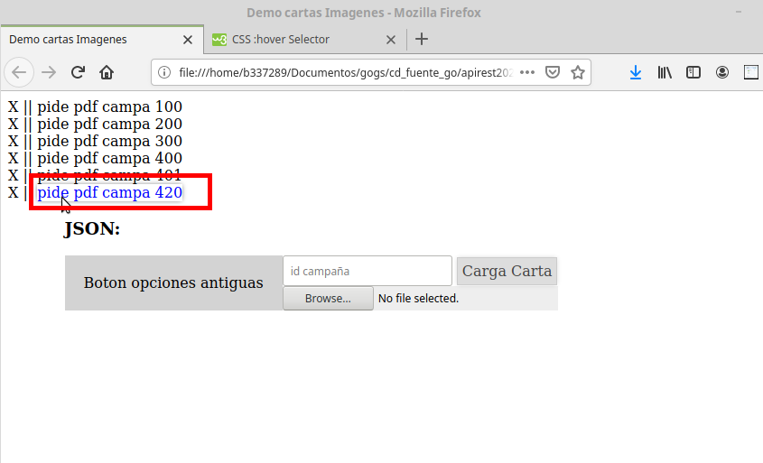
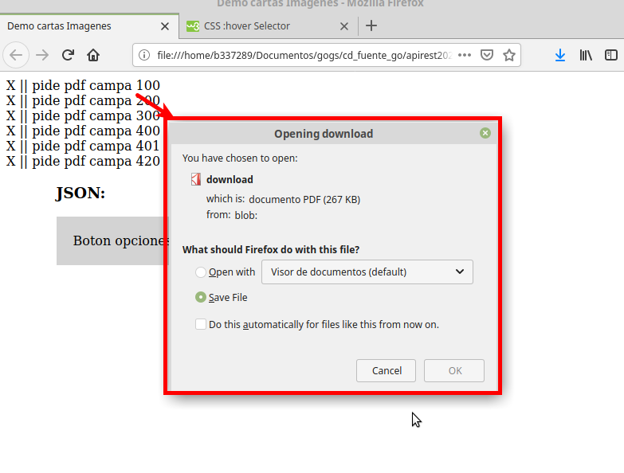
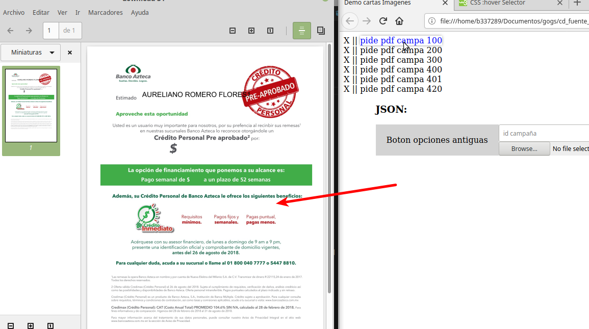

#### **cargar de imagenes**

Seleccionas la **imagen a cargar** que se debe previsualizar.

   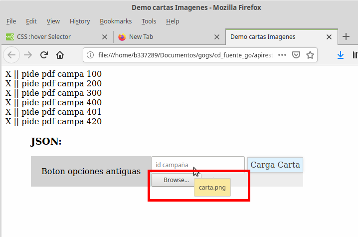

Ingresas la campaña como `numero` a **insertar o modificar**. 

   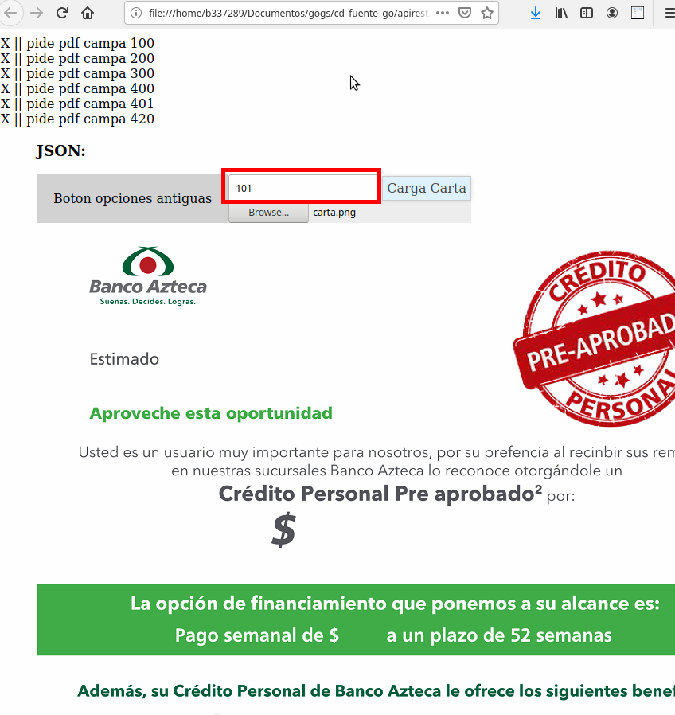

Agregas de ser necesario las etiquetas que se ocupen

   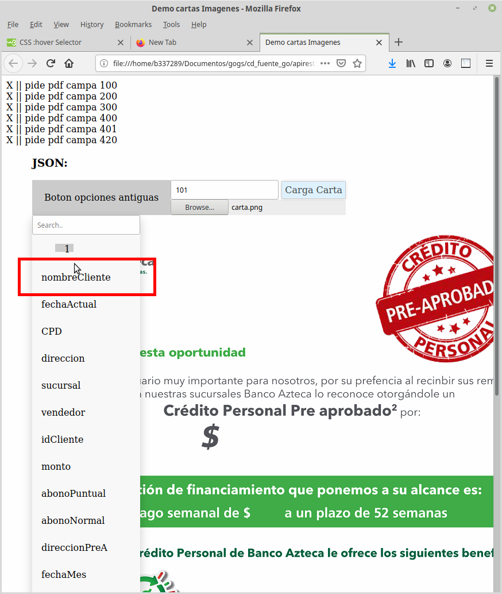
   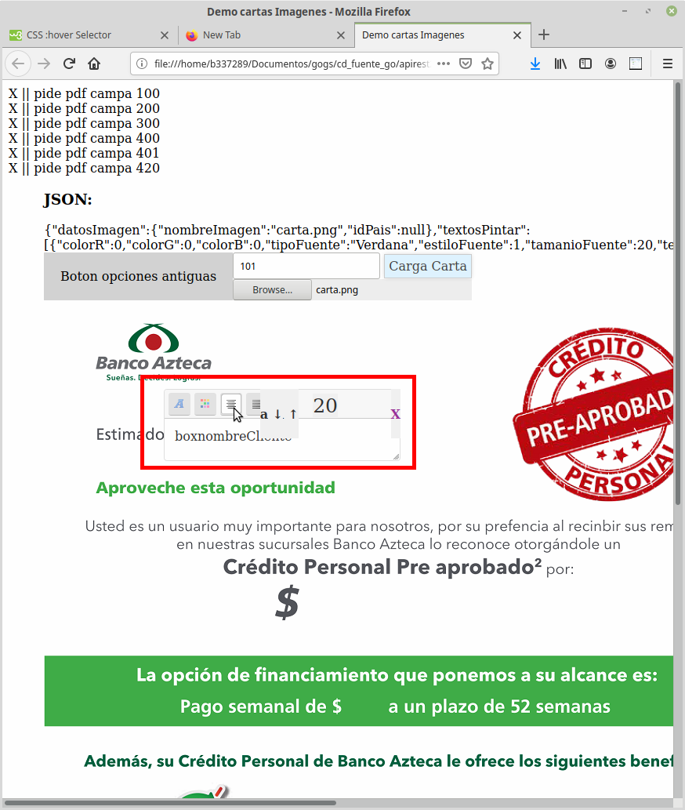

Das click en **`Carga Carta`** se recargara la pantalla y aparecera la nueva campaña en pantalla

   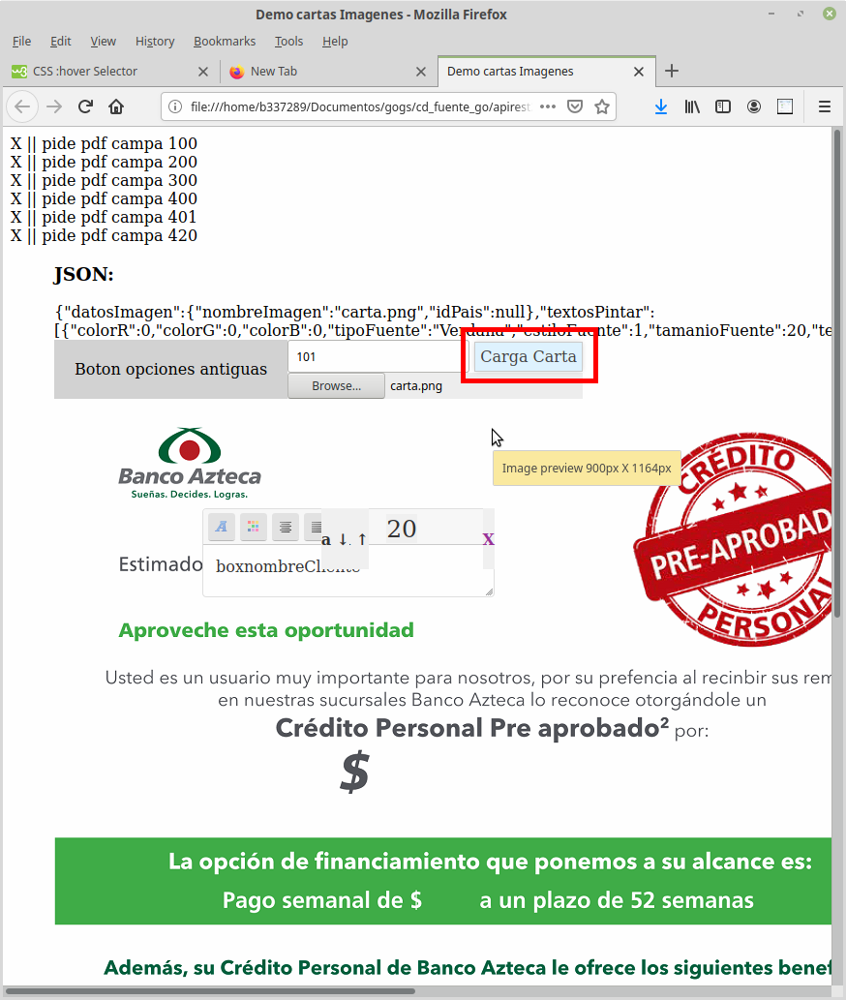
   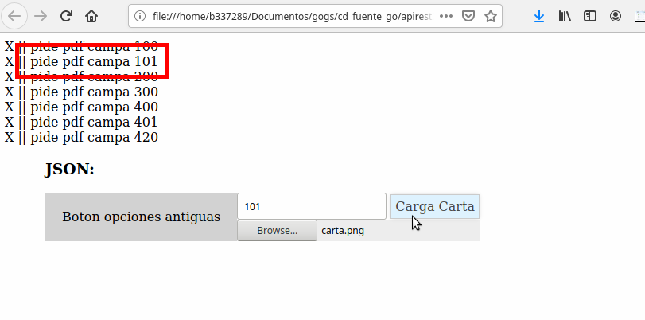

#### **editar de imagenes**

es necesario repetir el proceso de carga, si se detecta que la imagen ya ha sido cargada, se actualiza tanto imagen como etiquetas, en caso de no existir se recarga

#### **eliminar de imagenes**

se da click en la `X` al lado de cada imagen

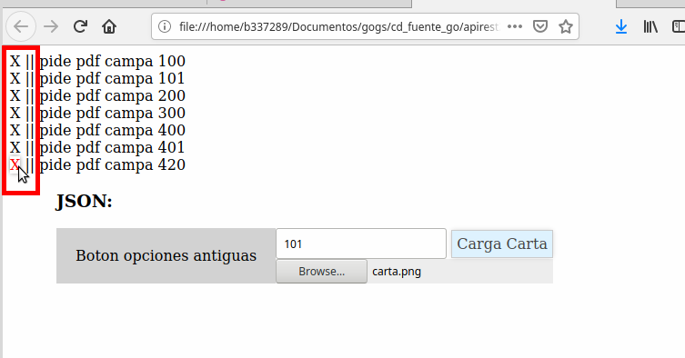

# **Notas tecnicas.**

#### **Uso de "cache"**

el aplicativo, tiene la funcion de crear imagenes que guarda en carpetas que se generan en donde sea que se coloque el codigo de go.
las direcciones se encuentran en constantes para su facil uso.

Los archivos de cache son 2:

    •imagen de carta
    •json de coordenadas

Estos se generan cada que la liga `/insertaImagenBase` es invocada para traer cartas, asi solo la primera vez que detecta que no existe cache se baja la imagen.

este cache es borrado, cada que una carta es eliminada con la liga `/insertaImagenBase` y cada que es actualizada con la liga `/insertaImagenBase`

acda que se llama la liga para generar imagen, se genera una `llave` con la fecha hasta los milisegundos, para crear usar y borrar las imagenes que X persona genera desde X equipo, asi 2 personas usando las mismas carpetas de cache pueden descargar las cartas de clientes diferentes desde el mismo servicio.

probado desde postman, se reducen los tiempos de 88 cartas en 40 segundos a 88 cartas en 26 segundos

# **Pendientes.**

El proyecto quedo con los siguientes pendientes para su pleno funcionamiento en `productivo`

    1.-Implementacion BD productiva
        • se dejan los script para alterar la tabla de banners, patra agregar el campo de etiquetas (validado por dba)
        • se deja los sp para el CRUD de las cartas, falta validar debido a que depende de el cambio de base anterior.
    2.-Generar el archivo binario para desplegar en prodyctivo
         • se generaron las clases que registran los servicios como en el proyecto ejemplo, pero desconozco ese flujo.  
    3.-Implementacion en front:
        •de acuerdo con el analisis, si el codigo generado, se inplementa en el actual proyecto de go, para que un vendedor pueda imprimir las cartas de sus clientes como imagenes, se debe cambiar la liga desde donde se descarga la actual carta, por la liga de descarga de imagenes

 dudas y acalraciones con gusto podemos tratarlos

## **Datos desarrollador.**

    Iglesias Ruiz Juan Carlos
    No. 654889
    jiglesias@elektra.com.mx
    cel.5546944360

saludos!